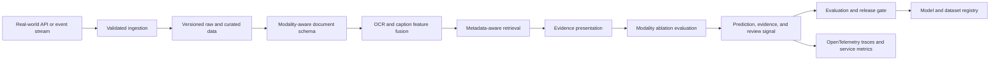

# Architecture

## Problem

Business documents contain meaning in text, tables, layout, and imagery that text-only retrieval can miss.

## System Flow

## Components

- **Modality-aware document schema**
- **OCR and caption feature fusion**
- **Metadata-aware retrieval**
- **Evidence presentation**
- **Modality ablation evaluation**

## Recommended Production Stack

- FastAPI for ingestion and multimodal search
- Transformers with LayoutLMv3 or ColPali-style encoders
- OCR adapter plus image captioning
- PostgreSQL plus pgvector for fused embeddings
- Object storage for source documents
- OpenTelemetry plus retrieval ablation reports

## Hugging Face Tasks

- `visual-document-retrieval`
- `document-question-answering`
- `image-to-text`
- `feature-extraction`

## Model Architecture

The included baseline is a transparent token-prototype model. Training builds
per-label token weights and inverse-document-frequency retrieval weights from
the synthetic training split. The runtime returns a prediction, confidence,
review flag, and evidence documents. This baseline is intentionally small so
it can run in CI without paid compute.

For production, compare it with domain embeddings, gradient-boosted models, or
fine-tuned transformer models using the same held-out evaluation contract.

## Production Boundaries

- Validate and version all input schemas.
- Keep human review for low-confidence or high-impact decisions.
- Store prompts, traces, model versions, and dataset versions together.
- Do not treat synthetic evaluation performance as production evidence.
- Add authentication, authorization, encryption, and retention controls.

## Known Risks

The starter dataset contains synthetic textual modality descriptors, not sensitive scanned documents.
